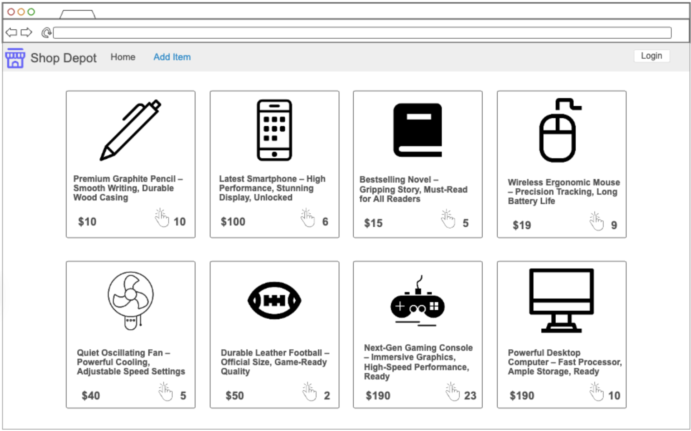
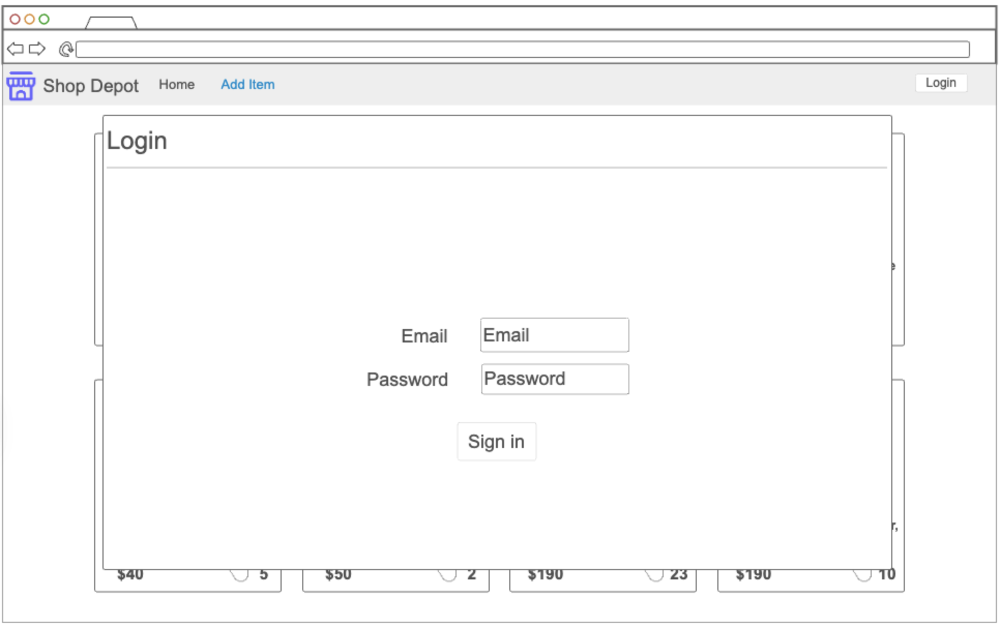
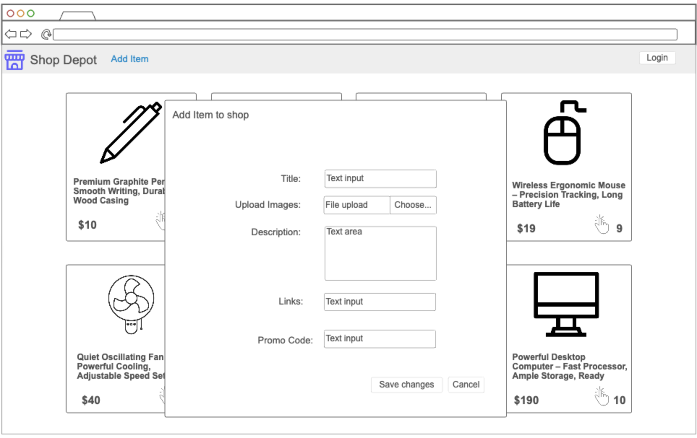
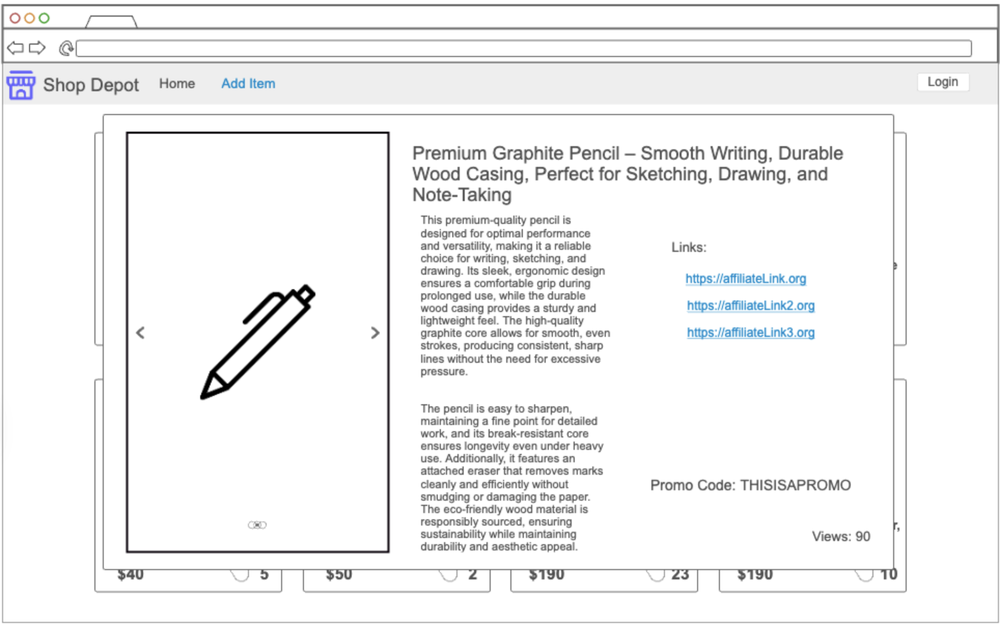

# ShopDepot

## Specification Deliverable

### Elevator pitch

We all know the feeling of spending hours on a Saturday clicking through links, hunting down the best deals on the best items. Oftentimes, these great deals come in the form of promotion codes offered by influencers. The problem is, unless you're following these influencers on one of a million different social media platforms, you’ll never even know these promo codes exist! Well, not anymore. Thanks to ShopDepot, the whole process is streamlined. Influencers simply post items with their description, links and promotions to ShopDepot, and consumers have a one stop shop to check out their offerings. If the consumer likes the item, all they have to do is click the link and enter the promo code to save big! It's like Amazon, but for great products and even better deals!

### Design
Mock Up of Home Screen

Mock Up of Login

Mock Up of Adding Items

Mock Up of Viewing Item Details

### Key features

- Login and logout over HTTPS
- Ability for authenticated users to add items
- All shop items are displayed in card views
- View, edit, or remove items you own
- Item info popups including description, pictures, links and promo codes
- Real time total clicks on item
- Navigation to listed affiliate links

### Technologies
- **HTML** - A single HTML page incorporating multiple HTML components for login, adding items, and viewing items.
- **CSS** - Consistent styling patterns throughout the application, with items displayed as Material Cards. Various other components such as login styled as pop ups.
- **React** - React handles login component, item display, adding items component, and routing.
- **Service** - RESTful APIs for:
  - Login
  - Retrieving all shop items from database
  - Adding items to database
  - Retrieving item details
  - Third party API to validate email and check for spam
- **DB/Login** - Ability to create accounts and log in users. Their credentials will be stored securely in the database. Users cannot add items unless they are authenticated. The database also stores shop items with associated information and the number of views.
- **WebSocket** - When a user clicks on an item, the number of views on the item will be incremented and broadcast to all other users in real time.

## HTML deliverable

For this deliverable I built out the structure of my application using HTML.

- [x] **HTML pages** - Multiple HTML pages that will eventually become components. This includes: login page, main store front, view item page and add item page.
- [x] **Links** - Link in navigation bar which takes you to the GitHub repo. Clicking login on any of the pages directs you to the login page. Clicking on the example item on the main store front takes you to the example item page. An add item button will navigate to the add item page. Finally, clicking on the top logo takes you to the main store front.
- [x] **Text** - The example item has text on both the main store front and in the item view page. Text used in the navigation bar and throughout the app to make the user experience easier.
- [x] **Images** - Example item has images and the navigation bar has logo.
- [x] **DB/Login** - Input boxes on login page with submit button or create account button. Creating item page also has input boxes for all the item details. Throughout the application, all input boxes that are required will be marked as required. Includes, a place holder for the api service that will check if email is valid.
- [x] **WebSocket** - A place holder text box is placed at the bottom of the example item card and in the example item page for when websockets eventually update view count on an item.

## CSS deliverable

For this deliverable I styled the application with the Bootstrap framework. Styling may need to be changed to display the items when the item information comes from the database.

- [x] **Header, footer, and main content body**
- [x] **Navigation elements** - I added a Bootstrap nav bar. Styled properly with login button on far right.
- [x] **Responsive to window resizing** - Resized page, navbar and modals to match screen size.
- [x] **Application elements** - Styled application elements using Bootstrap
- [x] **Application text content** - Consistent text styling across application
- [x] **Application images** - I used Bootstrap cards to display the item images and then a carousel to display the item image when inside the item details.

## React deliverable

I used React and Javascript to allow users to interact with the store front and add items.

- [x] **Bundled and transpiled** - done!
- [x] **Components** - Store front is the main component, login and add item modals with item card component which opens a modal when clicked, 
  - [x] **login** - When you press the login button, it launches the login modal. When logged in the modal will close and the button will be updated to log out
  - [x] **add item** - When you press the add item button it launches the add item modal. Here the user can put in the item information which will then be displayed on the store front.
  - [x] **item card** - Item card displays abridged information about the items stored in local storage.
  - [x] **item details** - Clicking on an item card will launch a modal containing all the information about the item.
  - [x] **database** - Displayed the items in the store from local storage. When items are updated the local storage is updated and the new item is displayed.
  - [x] **WebSocket** - Section on each item for tracking views which will be updated by websockets when we get there.
- [x] **Router** - Routing to the store front.
- [x] **Hooks** - uses 'useState' to track modal showing and closing. Also uses 'useState' to track logged in status and to track the items displayed.

## Service deliverable

For this deliverable I added backend endpoints that has login functionality and gets/adds items from the store

- [x] **Node.js/Express HTTP service**
- [x] **Static middleware for frontend** - This will work for when we deploy to AWS
- [x] **Calls to third party endpoints** - Calls an endpoint which checks if the email a user signs up with is a spam email
- [x] **Backend service endpoints** - Placeholders for login that stores the current users and placeholders for the current items in the shop
- [x] **Frontend calls service endpoints** - Called the backendpoints using fetch