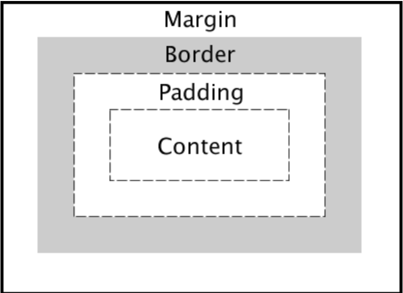
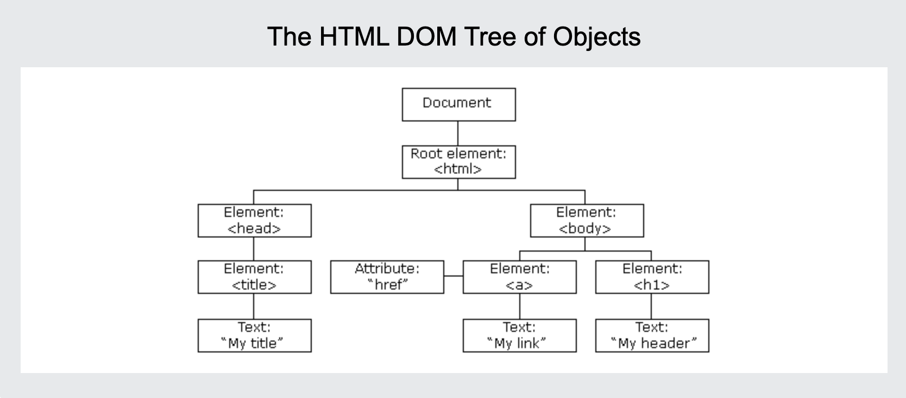

# Notes
## Comments
### 9/12/24
These are my first notes on the project. Struggled to get VSCode working properly but things seem to be runninng now. If I'm in the terminal I can type 'code' and the name of the file I want to access and it will open up VSCode

This is a link to the [README.md](README.md)

## General Notes
### HTML
All elements have attributes. For example id and class.
Attribute example
```html
<p id="hello" class="greeting">Hello world</p>
```
Anchor example:
```html
<a href="https://byu.edu">Go to the Y</a>
```
Common elements
| element   | meaning                                                                |
| --------- | ---------------------------------------------------------------------- |
| `html`    | The page container                                                     |
| `head`    | Header information                                                     |
| `title`   | Title of the page                                                      |
| `meta`    | Metadata for the page such as character set or viewport settings       |
| `script`  | JavaScript reference. Either a external reference, or inline           |
| `include` | External content reference                                             |
| `body`    | The entire content body of the page                                    |
| `header`  | Header of the main content                                             |
| `footer`  | Footer of the main content                                             |
| `nav`     | Navigational inputs                                                    |
| `main`    | Main content of the page                                               |
| `section` | A section of the main content                                          |
| `aside`   | Aside content from the main content                                    |
| `div`     | A block division of content                                            |
| `span`    | An inline span of content                                              |
| `h<1-9>`  | Text heading. From h1, the highest level, down to h9, the lowest level |
| `p`       | A paragraph of text                                                    |
| `b`       | Bring attention                                                        |
| `table`   | Table                                                                  |
| `tr`      | Table row                                                              |
| `th`      | Table header                                                           |
| `td`      | Table data                                                             |
| `ol,ul`   | Ordered or unordered list                                              |
| `li`      | List item                                                              |
| `a`       | Anchor the text to a hyperlink                                         |
| `img`     | Graphical image reference                                              |
| `dialog`  | Interactive component such as a confirmation                           |
| `form`    | A collection of user input                                             |
| `input`   | User input field                                                       |
| `audio`   | Audio content                                                          |
| `video`   | Video content                                                          |
| `svg`     | Scalable vector graphic content                                        |
| `iframe`  | Inline frame of another HTML page                                      |

Special Characters
| Character | Entity      |
| --------- | ----------- |
| &amp;     | `&amp;`     |
| <         | `&lt;`      |
| >         | `&gt;`      |
| "         | `&quot;`    |
| '         | `&apos;`    |
| &#128512; | `&#128512;` |

#### HTML Structure
The body has 3 children, header, main and footer

Block elements block the flow of the content structure. An inline element is inline with the flow of a block element. For example, `div` is a `block` element and b is an inline element

This is an example of HTML structure:

```html
      <table>
        <tr>
          <th>Table</th>
          <th>Table</th>
          <th>Table</th>
        </tr>
        <tr>
          <td>table</td>
          <td>table</td>
          <td>table</td>
        </tr>
        <tr>
          <td>HTML</td>
          <td>CSS</td>
          <td>JavaScript</td>
        </tr>
      </table>
```

#### Input elements
| Element    | Meaning                          | Example                                        |
| ---------- | -------------------------------- | ---------------------------------------------- |
| `form`     | Input container and submission   | `<form action="form.html" method="post">`      |
| `fieldset` | Labeled input grouping           | `<fieldset> ... </fieldset>`                   |
| `input`    | Multiple types of user input     | `<input type="" />`                            |
| `select`   | Selection dropdown               | `<select><option>1</option></select>`          |
| `optgroup` | Grouped selection dropdown       | `<optgroup><option>1</option></optgroup>`      |
| `option`   | Selection option                 | `<option selected>option2</option>`            |
| `textarea` | Multiline text input             | `<textarea></textarea>`                        |
| `label`    | Individual input label           | `<label for="range">Range: </label>`           |
| `output`   | Output of input                  | `<output for="range">0</output>`               |
| `meter`    | Display value with a known range | `<meter min="0" max="100" value="50"></meter>` |

The form element is to submit the inputs it contains.

The input element can have many different input types
| Type           | Meaning                           |
| -------------- | --------------------------------- |
| text           | Single line textual value         |
| password       | Obscured password                 |
| email          | Email address                     |
| tel            | Telephone number                  |
| url            | URL address                       |
| number         | Numerical value                   |
| checkbox       | Inclusive selection               |
| radio          | Exclusive selection               |
| range          | Range limited number              |
| date           | Year, month, day                  |
| datetime-local | Date and time                     |
| month          | Year, month                       |
| week           | Week of year                      |
| color          | Color                             |
| file           | Local file                        |
| submit         | button to trigger form submission |

To specify the type, include `type` in the element attributes

```html
<body>
  <h1>Example Form</h1>
  <form action="formSubmit.html" method="post">
    <ul>
      <li>
        <label for="textarea">TextArea: </label>
        <textarea id="textarea" name="varTextarea"></textarea>
      </li>
      <li>
        <label for="select">Select: </label>
        <select id="select" name="varSelect">
          <option>option1</option>
          <option selected>option2</option>
          <option>option3</option>
        </select>
      </li>
      <!-- Like select but with option groups -->
      <li>
        <label for="optgroup">OptGroup: </label>
        <select id="optgroup" name="varOptGroup">
          <optgroup label="group1">
            <option>option1</option>
            <option selected>option2</option>
          </optgroup>
          <optgroup label="group2">
            <option>option3</option>
            <option>option4</option>
          </optgroup>
          <optgroup label="group3">
            <option>option5</option>
            <option>option6</option>
          </optgroup>
        </select>
      </li>
      <li>
        <fieldset>
          <legend>checkbox</legend>
          <label for="checkbox1">checkbox1</label>
          <input type="checkbox" id="checkbox1" name="varCheckbox" value="checkbox1" checked />
          <label for="checkbox2">checkbox2</label>
          <input type="checkbox" id="checkbox2" name="varCheckbox" value="checkbox2" />
          <label for="checkbox3">checkbox3</label>
          <input type="checkbox" id="checkbox3" name="varCheckbox" value="checkbox3" />
          <label for="checkbox4">checkbox4</label>
          <input type="checkbox" id="checkbox4" name="varCheckbox" value="checkbox4" />
        </fieldset>
      </li>
      <li>
        <fieldset>
          <legend>radio</legend>
          <label for="radio1">radio1</label>
          <input type="radio" id="radio1" name="varRadio" value="radio1" checked />
          <label for="radio2">radio2</label>
          <input type="radio" id="radio2" name="varRadio" value="radio2" />
          <label for="radio3">radio3</label>
          <input type="radio" id="radio3" name="varRadio" value="radio3" />
          <label for.="radio4">radio4</label>
          <input type="radio" id="radio4" name="varRadio" value="radio3" />
        </fieldset>
      </li>
      <li>
        <label for="file">File: </label>
        <input type="file" id="file" name="varFile" accept="image/*" multiple />
      </li>
      <li>
        <label for="search">Search: </label>
        <input type="search" id="search" name="varSearch" />
      </li>
      <li>
        <label for="number">Number: </label>
        <input type="number" name="varNumber" id="number" min="1" max="10" step="1" />
      </li>
      <li>
        <label for="range">Range: </label>
        <input type="range" name="varRange" id="range" min="0" max="100" step="1" value="0" />
        <output id="rangeOutput" for="range">0</output>
      </li>
      <li>
        <label for="progress">Progress: </label>
        <progress id="progress" max="100" value="75"></progress>
      </li>
      <li>
        <label for="meter">Meter: </label>
        <meter id="meter" min="0" max="100" value="50" low="33" high="66" optimum="50"></meter>
      </li>
      <li>
        <label for="datetime">DateTime: </label>
        <input type="datetime-local" name="varDatetime" id="datetime" />
      </li>
      <li>
        <label for="time">Time: </label>
        <input type="time" name="varTime" id="time" />
      </li>
      <li>
        <label for="month">Month: </label>
        <input type="month" name="varMonth" id="month" />
      </li>
      <li>
        <label for="week">Week: </label>
        <input type="week" name="varWeek" id="week" />
      </li>
      <li>
        <label for="color">Color: </label>
        <input type="color" name="varColor" id="color" value="#FF0000" />
      </li>
      <input type="hidden" id="secretData" name="varSecretData" value="1989 - the web was born" />
    </ul>

    <button type="submit">Submit</button>
  </form>
</body>
```

#### HTML Media Elements
here are some html elements: `img`, `audio`, `video`, `svg`, `canvas`

here are some examples
```html


<audio controls src="sourceoftheaudio"></audio>

<video controls width="somewidth" crossorigin="include anonymous if you are requesting a file from a different domain">
    <source src="wherethevideocanbefound" />
</video>
```

SVG (Scalable Vector Graphics) and canvas allow you to create images in HTML for example

```html
<svg viewBox="0 0 200 200" xmlns="some address" stroke="color_you_want_lines_to_be" fill="color_you_want_the_shape_to_be">
    <circle cx="howwide" cy="howtall", r="radiusnumber />
</svg>

<canvas id="canvas" width="100" height="100"></canvas>
<script>
  const ctx = document.getElementById('canvaw').getContext('2d');
  ctx.beginPath();
  ctx.arc(100, 50, 50, 0, 2 * Math.PI);
  ctx.fillStyle = 'what_color';
  ctx.strokeStyle = 'what_color';
  ctx.fill();
  ctx.stroke();
</script>
```

#### how to start html
```html
<!DOCTYPE html>
<html lang="en">
  <body>
    <main>
```
### CSS
A `rule` has a `selector` that selects the elements and some `propery` with a `property value`. 
Can select all element tags. For example this selects all span elements
```html
span{
    ....
    ...
    ...
}
```

Can style inline
```html
<div style="color:green">CSS</div>
```

Or with a `style` element in the `head` element
```html
<head>
    <style>
        some rules
    </style>
</head>
```

or a link in the head
```html
<link rel="stylesheet" href="styles.css" />
```

Any property defined at a lower level will override a higher declaration

#### The box model

CSS surrounds everything in boxes. The innermost box is the element content. Then there is the padding. The padding can inherit the background color. Then there is the border (this has color, thickness and line styles). Then there is the margin which is considered external to the styling of the box. The margin represents whitespace and so won't inherit color.

The default width and height is defined by the element width and height. CSS can change the `box-sizing` from `content-box` to `border-box`. `border-box` redefines the width and height to include the padding and the border.

#### selectors
`*` is a wildcard selector that selects all elements

Combinators can be used to select specific elements here is a list

| Combinator       | Meaning                    | Example        | Description                                |
| ---------------- | -------------------------- | -------------- | ------------------------------------------ |
| Descendant       | A list of descendants      | `body span` | Any span that is a descendant of a body |
| Child            | A list of direct children  | `section > div`  | Any div that is a direct child of a section  |
| General sibling  | A list of siblings         | `div ~ h1`      | Any h1 that has a div sibling               |
| Adjacent sibling | A list of adjacent sibling | `span + h1`      | Any h1 that has an adjacent span sibling     |

Class selecting is done by prefixing with a `.`
You can combine elements and class selectors `h1.title`

ID selecto `#`

Attribute selector

`h1[class='title']` selects any `h1` with the class `title`

Pseudo selectors are CSS styles that apply when a certain state is reached for example `div:hover` calls this style when the mouse hovers over the div

#### Properties
| Property           | Value                              | Example             | Discussion                                                                     |
| ------------------ | ---------------------------------- | ------------------- | ------------------------------------------------------------------------------ |
| background-color   | color                              | `red`               | Fill the background color                                                      |
| border             | color width style                  | `#fad solid medium` | Sets the border using shorthand where any or all of the values may be provided |
| border-radius      | unit                               | `50%`               | The size of the border radius                                                  |
| box-shadow         | x-offset y-offset blu-radius color | `2px 2px 2px gray`  | Creates a shadow                                                               |
| columns            | number                             | `3`                 | Number of textual columns                                                      |
| column-rule        | color width style                  | `solid thin black`  | Sets the border used between columns using border shorthand                    |
| color              | color                              | `rgb(128, 0, 0)`    | Sets the text color                                                            |
| cursor             | type                               | `grab`              | Sets the cursor to display when hovering over the element                      |
| display            | type                               | `none`              | Defines how to display the element and its children                            |
| filter             | filter-function                    | `grayscale(30%)`    | Applies a visual filter                                                        |
| float              | direction                          | `right`             | Places the element to the left or right in the flow                            |
| flex               |                                    |                     | Flex layout. Used for responsive design                                        |
| font               | family size style                  | `Arial 1.2em bold`  | Defines the text font using shorthand                                          |
| grid               |                                    |                     | Grid layout. Used for responsive design                                        |
| height             | unit                               | `.25em`             | Sets the height of the box                                                     |
| margin             | unit                               | `5px 5px 0 0`       | Sets the margin spacing                                                        |
| max-[width/height] | unit                               | `20%`               | Restricts the width or height to no more than the unit                         |
| min-[width/height] | unit                               | `10vh`              | Restricts the width or height to no less than the unit                         |
| opacity            | number                             | `.9`                | Sets how opaque the element is                                                 |
| overflow           | [visible/hidden/scroll/auto]       | `scroll`            | Defines what happens when the content does not fix in its box                  |
| position           | [static/relative/absolute/sticky]  | `absolute`          | Defines how the element is positioned in the document                          |
| padding            | unit                               | `1em 2em`           | Sets the padding spacing                                                       |
| left               | unit                               | `10rem`             | The horizontal value of a positioned element                                   |
| text-align         | [start/end/center/justify]         | `end`               | Defines how the text is aligned in the element                                 |
| top                | unit                               | `50px`              | The vertical value of a positioned element                                     |
| transform          | transform-function                 | `rotate(0.5turn)`   | Applies a transformation to the element                                        |
| width              | unit                               | `25vmin`            | Sets the width of the box                                                      |
| z-index            | number                             | `100`               | Controls the positioning of the element on the z axis                          |

#### Units
| Unit | Description                                                      |
| ---- | ---------------------------------------------------------------- |
| px   | The number of pixels                                             |
| pt   | The number of points (1/72 of an inch)                           |
| in   | The number of inches                                             |
| cm   | The number of centimeters                                        |
| %    | A percentage of the parent element                               |
| em   | A multiplier of the width of the letter `m` in the parent's font |
| rem  | A multiplier of the width of the letter `m` in the root's font   |
| ex   | A multiplier of the height of the element's font                 |
| vw   | A percentage of the viewport's width                             |
| vh   | A percentage of the viewport's height                            |
| vmin | A percentage of the viewport's smaller dimension                 |
| vmax | A percentage of the viewport's larger dimension                  |

#### Color
| Method       | Example                   | Description                                                                                                                                                                                                       |
| ------------ | ------------------------- | ----------------------------------------------------------------------------------------------------------------------------------------------------------------------------------------------------------------- |
| keyword      | `red`                     | A set of predefined colors (e.g. white, cornflowerblue, darkslateblue)                                                                                                                                            |
| RGB hex      | `#00FFAA22` or `#0FA2`    | Red, green, and blue as a hexadecimal number, with an optional alpha opacity                                                                                                                                      |
| RGB function | `rgb(128, 255, 128, 0.5)` | Red, green, and blue as a percentage or number between 0 and 255, with an optional alpha opacity percentage                                                                                                       |
| HSL          | `hsl(180, 30%, 90%, 0.5)` | Hue, saturation, and light, with an optional opacity percentage. Hue is the position on the 365 degree color wheel (red is 0 and 255). Saturation is how gray the color is, and light is how bright the color is. |

#### Font
`font-family` defines what font is used
There are 4 major font families
`Serif` a serif is a small stroke at the end of characters
`sans-serif` fonts that do not have the small stroke
`fixed` fonts with characters all the same size
`symbol` non characters like emojis

This is how you can import a font
```html
@font-face {
  font-family: 'Dune';
  src: url('somefontsource/fonts/dune.ttf');
}

p {
  font-family: Dune;
}
```

#### Animations
you give an `animation-name` and an `animation-duration` in the selector
Then you define the `animation-name` and its animation in `@keyframes animation name`
Inside `@keyframes` there is a `from` and `to` block, you can include a percentage block for when the block gets paritially through the animation.
for example
```html
h1 {
    text-align: right;
    animation-name: to-the-right;
    animation-duration: 10s;
}
@keyframes to-the-right {
    from {
        text-align: center;
    }

    50% {
        text-align: left;
    }

    to {
        text-align: right;
    }
}
```

#### Display
| Value  | Meaning                                                                                                                      |
| ------ | ---------------------------------------------------------------------------------------------------------------------------- |
| none   | Don't display this element. The element still exists, but the browser will not render it. It won't take up space in the display                   |
| block  | Display this element with a width that fills its parent element. A `p` or `div` element has block display by default.        |
| inline | Display this element with a width that is only as big as its content. A `b` or `span` element has inline display by default. |
| flex   | Display this element's children in a flexible orientation.                                                                   |
| grid   | Display this element's children in a grid orientation.                                                                       |

#### Viewport meta tag
to avoid small screens automatically scaling your webpage
`<meta name="viewport" content="width=device-width,initial-scale=1" />`

#### Float
`float` property moves an element to the left or right of its parent element. Inline elements then wrap around it

#### Grid
`1fr` is one fractional unit. When the content is displayed, grids will break the parent element into equal portions that are all a fractional unity.

| **Property**               | **Description**                                                                                          |
|----------------------------|----------------------------------------------------------------------------------------------------------|
| `display: grid`             | Defines the element as a grid container, creating a block-level grid.                                     |
| `grid-template-columns`     | Defines the number of columns and their widths.                                                          |
| `grid-template-rows`        | Defines the number of rows and their heights.                                                            |
| `grid-column-gap`           | Sets the size of the gap between columns.                                                       |
| `grid-row-gap`              | Sets the size of the gap between rows.                                                          |
| `grid-column-start`         | The starting position of a grid item, counted by the grid lines.                               |
| `grid-column-end`           | The ending position of a grid item, counted by the grid lines.                                 |
| `grid-row-start`            | The starting position of a grid item, counted by the grid lines.                               |
| `grid-row-end`              | The ending position of a grid item, counted by the grid lines.                                 |
| `grid-auto-flow`            | How auto-placed items are inserted into the grid.                                               |
| `grid-auto-columns`         | Defines the size of implicit columns.                                                                    |
| `grid-auto-rows`            | Defines the size of implicit rows.                                                                       |
| `justify-items`             | Aligns items along the row (inline) axis.                                                           |
| `align-items`               | Aligns items along the column (block) axis.                                                         |
| `justify-content`           | Aligns the grid as a whole along the row (inline) axis.                                                  |
| `align-content`             | Aligns the grid as a whole along the column (block) axis.                                                |
| `justify-self`              | Aligns a single grid item along the row (inline) axis.                                                   |
| `align-self`                | Aligns a single grid item along the column (block) axis.                                                 |

#### Flex
Use `flex` when you want to parition you page into areas that can change size when the window changes size
`flex` needs a `flex-driection`
`flex: 0 20px` creates a fixe sized box of 20px in height. The 0 means it will not grow
`flex: 1` means that the element gets 1 fractional unit of space
If you have two elements in line with each other the display will break the window into fractional units based on how you dictate. For example if I wanted div1 to be 5 fractional units and div2 to be 2 fractional units I could write this
```html
.div1 {
    flex: 5
}
.div2 {
    flex: 2
}
```
| **Property**              | **Description**                                                                                         |
|---------------------------|---------------------------------------------------------------------------------------------------------|
| `display: flex`           | Defines a flex container, enabling flexbox layout.                                                      |
| `flex-direction`          | Defines the direction of the flex items inside the container (row, row-reverse, column, column-reverse). |
| `flex-wrap`               | Controls whether the flex items should wrap onto multiple lines (nowrap, wrap, wrap-reverse).            |
| `justify-content`         | Aligns the flex items along the main axis (start, end, center, space-between, space-around, space-evenly).|
| `align-items`             | Aligns flex items along the cross axis (stretch, start, end, center, baseline).                         |
| `align-content`           | Aligns a flex container’s lines when there is extra space on the cross axis (stretch, start, end, center, space-between, space-around). |
| `align-self`              | Aligns a single flex item along the cross axis (auto, start, end, center, stretch).                     |
| `flex-grow`               | Defines the ability for a flex item to grow if necessary.                                                |
| `flex-shrink`             | Defines the ability for a flex item to shrink if necessary.                                              |
| `flex-basis`              | Defines the default size of a flex item before it is distributed according to `flex-grow` and `flex-shrink`. |
| `order`                   | Specifies the order of a flex item relative to others.                                                  |
| `gap`                     | Sets the gap between flex items.                                                                        |
| `row-gap`                 | Sets the gap between rows of flex items.                                                                |
| `column-gap`              | Sets the gap between columns of flex items.                                                             |

#### Media queries
`@media` slector to dynamically detect screen size and orientation. CSS rules can be place in the selector to accommodate changes

#### CSS frameworks
How to add bootstrap
```html
<head>
    <meta name="viewport" content="width=device-width, initial-scale=1" />
    <link
      href="https://cdn.jsdelivr.net/npm/bootstrap@5.2.3/dist/css/bootstrap.min.css"
      rel="stylesheet"
      integrity="sha384-rbsA2VBKQhggwzxH7pPCaAqO46MgnOM80zW1RWuH61DGLwZJEdK2Kadq2F9CUG65"
      crossorigin="anonymous"
    />
  </head>
```

### Javascript
`console.log('hello');`
Styled CSS logs: `console.log('%c danger', 'font-size:10px; color:red;');`
Timer:
```javascript
console.time('start time');
// .....
console.timeEnd('start time');
// output: start time: time
```
Count code blocks `console.count('a');`

#### Java script in html
include `<script>` element or use a `<script scr="">` to link a script
buttons have onclick attribute that can call javascript 
`<button onclick="let i=hello world;console.log(i)">press</button>`

#### declare variables
`let` or `const`

#### Types
Primitive types
| Type        | Meaning                                                    |
| ----------- | ---------------------------------------------------------- |
| `Null`      | The type of a variable that has not been assigned a value. |
| `Undefined` | The type of a variable that has not been defined.          |
| `Boolean`   | true or false.                                             |
| `Number`    | A 64-bit signed number.                                    |
| `BigInt`    | A number of arbitrary magnitude.                           |
| `String`    | A textual sequence of characters.                          |
| `Symbol`    | A unique value.                                            |

Object types
| Type       | Use                                                                                    | Example                  |
| ---------- | -------------------------------------------------------------------------------------- | ------------------------ |
| `Object`   | A collection of properties represented by name-value pairs. Values can be of any type. | `{a:3, b:'fish'}`        |
| `Function` | An object that has the ability to be called.                                           | `function a() {}`        |
| `Date`     | Calendar dates and times.                                                              | `new Date('1995-12-17')` |
| `Array`    | An ordered sequence of any type.                                                       | `[3, 'fish']`            |
| `Map`      | A collection of key-value pairs that support efficient lookups.                        | `new Map()`              |
| `JSON`     | A lightweight data-interchange format used to share information across programs.       | `{"a":3, "b":"fish"}`    |

#### Operators
`====` (equality), `+` can concatenate a string

#### type conversion
Java script is weakly typed meaning variables can change types
Some examples
```javascript
4 + '4';
// OUTPUT: '44'
2 * '8';
// OUTPUT: 16
[5] + [7];
// OUTPUT: '57'
true + null;
// OUTPUT: 1
true + undefined;
// OUTPUT: NaN
```

use `====` for strict equality

#### conditionals
`if` `else` `if else` are normal
ternary operator
`gamma ==== 'hello' ? console.log('true') : console.log('false');`

`&&`, `||`, `!`

#### loops
`for` is normal
`while` is normal
`do while`
```javascript
do {
    //.....
} while (condition);
```

`for in` iterates over object's property names and the indexes of an array
`for of` iterates over an iterables property values. Examples of iterables are Arrays maps and sets

#### strings
make a string with `'` `"` or backtick
nice string functions
| Function      | Meaning                                                      |
| ------------- | ------------------------------------------------------------ |
| length        | The number of characters in the string                       |
| indexOf()     | The starting index of a given substring                      |
| split()       | Split the string into an array on the given delimiter string |
| startsWith()  | True if the string has a given prefix                        |
| endsWith()    | True if the string has a given suffix                        |
| toLowerCase() | Converts all characters to lowercase                         |

#### functions
define functions by `function hello(world) {} `
default parameter values `function hello(hello, world = 'world'){}` in this case if a value isn't provided for `hello` then it will be sent to undefined
functions can be assigned to a variable so that they can be passed into function parameters. This is called anonymous functions
Functions can also have inner functions

#### arrow functions
`() => 3;` returns 3
Inherits `this` pointer from the scope that its called in.
`(a,b) => [a,b]` returns `[a,b]`

#### arrays
`a.length` for length
| Function | Meaning                                                   | Example                       |
| -------- | --------------------------------------------------------- | ----------------------------- |
| push     | Add an item to the end of the array                       | `a.push(4)`                   |
| pop      | Remove an item from the end of the array                  | `x = a.pop()`                 |
| slice    | Return a sub-array                                        | `a.slice(1,-1)`               |
| sort     | Run a function to sort an array in place, if negative, a before b if positive or 0, b before a                 | `a.sort((a,b) => b-a)`        |
| values   | Creates an iterator for use with a `for of` loop          | `for (i of a.values()) {...}` |
| find     | Find the first item satisfied by a test function          | `a.find(i => i < 2)`          |
| forEach  | Run a function on each array item                         | `a.forEach(console.log)`      |
| reduce   | Run a function to reduce each array item to a single item | `a.reduce((a, c) => a + c)`   |
| map      | Run a function to map an array to a new array             | `a.map(i => i+i)`             |
| filter   | Run a function to remove items                            | `a.filter(i => i%2)`          |
| every    | Run a function to test if all items match                 | `a.every(i => i < 3)`         |
| some     | Run a function to test if any items match                 | `a.some(i => i < 1)`          |

#### JSON
JavaScript Object Notation
Way to share data
Key is always a string
| Type    | Example                 |
| ------- | ----------------------- |
| string  | "crockford"             |
| number  | 42                      |
| boolean | true                    |
| array   | [null,42,"crockford"]   |
| object  | {"a":1,"b":"crockford"} |
| null    | null                    |

```json
{
    "this is something": {
        "item": "stuff"
    },
    "another thing": ["kljlkjd"],
}
```

converting to json and back
```js
const object = { a:10, item: 'value'};
const json = JSON.stringify(object);
const object = JSON.parse(json);
```
Json cannot represent `undefined` and will drop keys with that value

#### Objects
you can access object properties by `obj.prop` or `obj['prop']`
can create an object with `const obj = new Object({ key: value });` or const obj = { key: value };
`Object.entries(obj)` returns key value pairs in the form `[['key', value], ['key', 'value']]`
`Object.keys(obj)` returns keys in the form `['key1', 'key2']`
`Object.values(obj)` returns values
Any function that returns an object is considered a constructor and can be called with the `new` operator

can have classes
```js
class ExampleClass {
    #name // private value
    constructor(someValue) {
        this.someValue = someValue;
        this.#name = 'james'
    }

    log() { //how to define function
        //.....
    }

}

const class = new ExampleClass('value);
class.log();

```

Inherit iwth `extends` key word, use `super` to call a class from the parent. Any function in child that has the same name as the parent will override the parent

#### Regex
can create regex with `const reg = new RegExp('abcd', 'l');`
or `const literal = /abcd/l;`
strings have functions that accept regex like `match`,`replace`,`search`,`split`,`test`

#### rest
`rest` is a parameter that holds the other parameters and it will combine them into an array
`function restExample(variable, variable, ...variables) {}`

#### spread
spread takes an oject that is iterable and expands it into the function parameters
`spreadExample(...[1,2,3,4]);`

#### try catch
```js
try {

} catch (err) {

} finally {

}
```

#### DOM
Document Object Model

browser provides a global variable called `document` that points to the dom

Every element in HTML has a node in the DOM (element, attributes, text, comments, and whitespace), this is in a tree.



Everything in the DOM has a `.tagName` and a `.children`

`textContext` contains all of the element's text

`.innerHTML` returns the text representation of the elements content

`.removeChild(el)` removes a child

`.createElemt('div')` creates an element with the div tag

`.querySelector('div')` is a CSS selector that looks for an element with that selector. 
The parameter works the same as CSS selectors

`.querySelectorAll('div')` gets an array of these elements

`.addEventListener('click', () => console.log(3))` adds a click listner
| **Event Listener**       | **Description**                                                                                              |
|--------------------------|--------------------------------------------------------------------------------------------------------------|
| `click`                  | Fires when the element is clicked.                                                                            |
| `dblclick`               | Fires when the element is double-clicked.                                                                     |
| `mousedown`              | Fires when the mouse button is pressed down on the element.                                                   |
| `mouseup`                | Fires when the mouse button is released over the element.                                                     |
| `mouseover`              | Fires when the mouse pointer is moved onto the element.                                                       |
| `mouseout`               | Fires when the mouse pointer is moved out of the element.                                                     |
| `mousemove`              | Fires when the mouse pointer is moved within the element.                                                     |
| `keydown`                | Fires when a key is pressed down.                                                                             |
| `keyup`                  | Fires when a key is released.                                                                                 |
| `keypress`               | Fires when a key that produces a character value is pressed down.                                             |
| `input`                  | Fires when the value of an `<input>` or `<textarea>` element is changed.                                      |
| `change`                 | Fires when the value of an `<input>`, `<textarea>`, or `<select>` element is committed.                       |
| `submit`                 | Fires when a form is submitted.                                                                               |
| `focus`                  | Fires when an element gains focus (like when clicked or tabbed to).                                           |
| `blur`                   | Fires when an element loses focus.                                                                            |
| `resize`                 | Fires when the document view (window) is resized.                                                             |
| `scroll`                 | Fires when the user scrolls an element or the document.                                                       |
| `load`                   | Fires when an element (like an image) or the entire page has loaded.                                          |
| `unload`                 | Fires when the page is unloaded or closed.                                                                    |
| `dragstart`              | Fires when the user starts dragging an element.                                                               |
| `drag`                   | Fires when an element is being dragged.                                                                       |
| `dragover`               | Fires when a dragged element is being dragged over a valid drop target.                                       |
| `drop`                   | Fires when a dragged element is dropped on a valid drop target.                                               |
| `dragend`                | Fires when a user finishes dragging an element.                                                               |
| `touchstart`             | Fires when a touch event starts on touch screen devices.                                                      |
| `touchmove`              | Fires when a touch point moves across the touch surface.                                                      |
| `touchend`               | Fires when a touch point is removed from the touch surface.                                                   |
| `contextmenu`            | Fires when the right mouse button is clicked (to open the context menu).                                      |
| `wheel`                  | Fires when the mouse wheel is scrolled.                                                                       |
| `copy`                   | Fires when text or content is copied.                                                                         |
| `cut`                    | Fires when text or content is cut.                                                                            |
| `paste`                  | Fires when text or content is pasted.                                                                         |
| `focusin`                | Fires when an element is about to receive focus (bubbles up).                                                 |
| `focusout`               | Fires when an element is about to lose focus (bubbles up).                                                    |
| `animationstart`         | Fires when a CSS animation starts.                                                                            |
| `animationend`           | Fires when a CSS animation ends.                                                                              |
| `animationiteration`      | Fires when a CSS animation is repeated.                                                                       |
| `transitionstart`        | Fires when a CSS transition starts.                                                                           |
| `transitionend`          | Fires when a CSS transition has completed.                                                                    |
| `pointerdown`            | Fires when a pointer (mouse, touch, pen) is pressed down on an element.                                       |
| `pointerup`              | Fires when a pointer (mouse, touch, pen) is released.                                                         |
| `pointermove`            | Fires when the pointer moves.                                                                                 |
| `pointerenter`           | Fires when the pointer enters an element.                                                                     |
| `pointerleave`           | Fires when the pointer leaves an element.                                                                     |
| `visibilitychange`       | Fires when the visibility of the document changes (e.g., switching tabs).                                     |

#### switch statements
```js
switch(expression) {
    case value1:
        //
        break;
    case value2:
        //
        break;
    default:
        //
}
//If you don't have a break then the switch will fall through to the next case
```
#### Promises
Promises have 3 states
- pending - Currenty running asynchronously
- Fulfilled - completed successfully
- rejected - failed to complete

The promise executor function takes two functions as parameters, `resolve` and `reject`

Calling either one of the functions will set the state to fulfulled or rejected

Their parameters will be returned to `then` and `catch`


`then`,`catch`,`finally`. `finally` is called always after the processing of the promise is complete

```js
function pickupPizza() {
  const order = createOrder();

  // Promise
  placeOrder(order)
    .then((order) =>
      makeOrder(order)
        .then((order) => serveOrder(order))
        .catch((order) => orderFailure(order))
    )
    .catch((order) => {
      orderFailure(order);
    });
}
function placeOrder(order) {
  return new Promise((resolve, reject) => {
    doWork(order, 1000, 3000, resolve, reject, `cashier too busy`);
  });
}

function makeOrder(order) {
  return new Promise((resolve, reject) => {
    doWork(order, 1000, 3000, resolve, reject, `cook burned the food`);
  });
}

function doWork(order, min, max, resolve, reject, errMsg) {
  let workTime = Math.random() * (max - min) + min;
  setTimeout(() => {
    workTime = Math.round(workTime);
    if (workTime < max * 0.85) {
      resolve(order);
    } else {
      order.error = errMsg;
      reject(order);
    }
  }, workTime);
}
```
#### async/await
`async/await` is a more concise representation of promises.
`await` wraps the execution of a promise so if we have a function that returns a promise such as `examplePromise()` then to call await we would `const result = await examplePromise()`
Can put await in try catch block, try replaces the `.then` but otherwise its pretty much the same

Cannot call `await` unless it is in the top level or is in a function defined with `async`. Async functions require a promise to return, if a promise is not returned then the return value is set to the fullilled value of the promise. 

`await` can wrap a call to an async function to resolve the Promise

```js
async function pickupPizza() {
  const order = createOrder();

  // Promise
  try {
    let result = await placeOrder(order);
    serveOrder(result)
  } catch (err) {
    orderFailure(err)
  }
}
```
## The console
`pwd` gives path to working directory
`ls` lists all the files in the directory
`ls -la` list all the files with the long format

- **echo** - Output the parameters of the command
- **cd** - Change directory
- **mkdir** - Make directory
- **rmdir** - Remove directory
- **rm** - Remove file(s)
- **mv** - Move file(s)
- **cp** - Copy files
- **ls** - List files
- **curl** - Command line client URL browser
- **grep** - Regular expression search
- **find** - Find files
- **top** - View running processes with CPU and memory usage
- **df** - View disk statistics
- **cat** - Output the contents of a file
- **less** - Interactively output the contents of a file
- **wc** - Count the words in a file
- **ps** - View the currently running processes
- **kill** - Kill a currently running process
- **sudo** - Execute a command as a super user (admin)
- **ssh** - Create a secure shell on a remote computer
- **scp** - Securely copy files to a remote computer
- **history** - Show the history of commands
- **ping** - Check if a website is up
- **tracert** - Trace the connections to a website
- **dig** - Show the DNS information for a domain
- **man** - Look up a command in the manual

`|` to chain the output from the left and make it the input of the right
`>` to direct to an output file and override it
`>>` to direct to an output file and append it
`grep` to search files
`wc` to count
`vi` opens a console ide vim

` ssh -i [key pair file] ubuntu@[ip address]`
## Test questions
In the following code, what does the link element do?

In the following code,  what does a div tag do?

In the following code, what is the difference between the #title and .grid selector?

In the following code, what is the difference between padding and margin?

Given this HTML and this CSS how will the images be displayed using flex?

What does the following padding CSS do?

What does the following code using arrow syntax function declaration do?

What does the following code using map with an array output?

What does the following code output using getElementByID and addEventListener?

What does the following line of Javascript do using a # selector?

Which of the following are true? (mark all that are true about the DOM)

By default, the HTML span element has a default CSS display property value of: inline

How would you use CSS to change all the div elements to have a background color of red?

How would you display an image with a hyperlink in HTML? surround it with an anchor tag

In the CSS box model, what is the ordering of the box layers starting at the inside and working out?

Given the following HTML, what CSS would you use to set the text "trouble" to green and leave the "double" text unaffected?

What will the following code output when executed using a for loop and console.log?

How would you use JavaScript to select an element with the id of “byu” and change the text color of that element to green?

What is the opening HTML tag for a paragraph, ordered list, unordered list, second level heading, first level heading, third level heading?

How do you declare the document type to be html?

What is valid javascript syntax for if, else, for, while, switch statements?

What is the correct syntax for creating a javascript object?

Is it possible to add new properties to javascript objects? Yes

If you want to include JavaScript on an HTML page, which tag do you use?

Given the following HTML, what JavaScript could you use to set the text "animal" to "crow" and leave the "fish" text unaffected?

Which of the following correctly describes JSON?

What does the console command chmod, pwd, cd, ls, vim, nano, mkdir, mv, rm, man, ssh, ps, wget, sudo  do?

Which of the following console command creates a remote shell session?

Which of the following is true when the -la parameter is specified for the ls console command?

Which of the following is true for the domain name banana.fruit.bozo.click, which is the top level domain, which is a subdomain, which is a root domain? .click is the top level root is the value left of the top level domain, sub domain is left of the root. sub domains can be stacked

Is a web certificate is necessary to use HTTPS. Yes

Can a DNS A record can point to an IP address or another A record. both

Port 443, 80, 22 is reserved for which protocol? HTTPS

What will the following code using Promises output when executed?